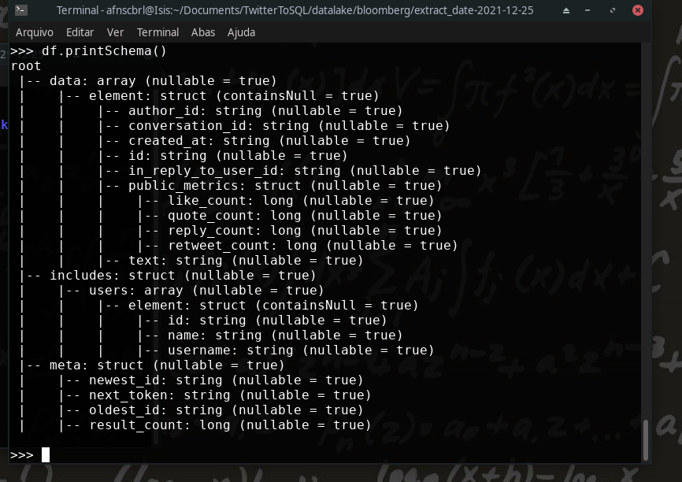
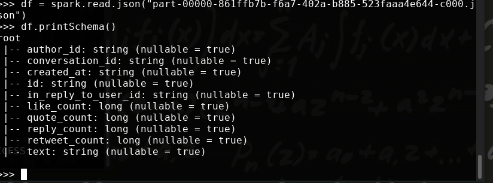
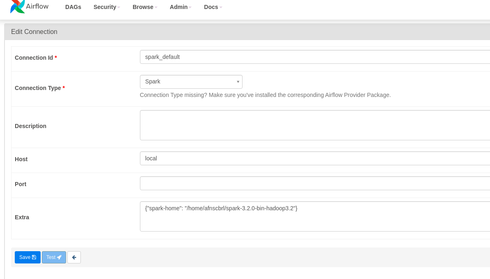
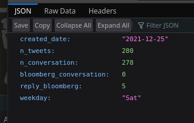
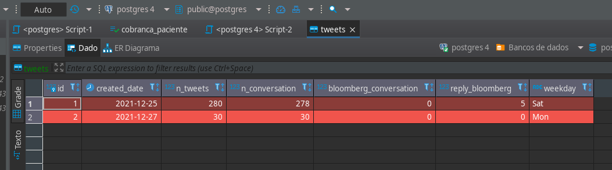

## Tweets to Postgresql with Airflow and Spark

**Intro:**<br/>
  I developed a system that get tweets in Twitter API and transform it on data lake to push them on database with Postgresql.

**Motivation and Goal:**<br/>
  I was tryin understand how Airflow works to orchestrate tasks and how Spark manipulate data, basicaly i was studyin a real case of ETL and Datalake with this two tools.
  
**Phases:**
  - Testing Twitter API
  - Connecting to Twitter
  - Creating a DAG
  - Getting the data
  - First tranformation of the data (Bronze to Silver)
  - Second transformation of the data (Silver to Gold)
  - Filling in a table database with the tweets of the Gold stage.

**Versions:**
  - Python 3.9
  - Apache Airflow 2.2.3
  - Apache Spark 3.2

### Testing the Twitter API

First of all, i developed a small script to test the Twitter API and look at the data response, in this case, a json file. In this script i dont included at final repo cause its made for test but a quote it here:

```
import requests
import os
import json

def auth():
    return os.environ.get("BEARER_TOKEN")

def create_url():
    query = "AluraOnline"
    # Tweet fields are adjustable.
    # Options include:
    # attachments, author_id, context_annotations,
    # conversation_id, created_at, entities, geo, id,
    # in_reply_to_user_id, lang, non_public_metrics, organic_metrics,
    # possibly_sensitive, promoted_metrics, public_metrics, referenced_tweets,
    # source, text, and withheld
    tweet_fields = "tweet.fields=author_id,conversation_id,created_at,id,in_reply_to_user_id,public_metrics,text"
    user_fields = "expansions=author_id&user.fields=id,name,username,created_at"
    filters = "start_time=2021-02-15T00:00:00.00Z&end_time=2021-02-19T00:00:00.00Z"
    url = "https://api.twitter.com/2/tweets/search/recent?query={}&{}&{}&{}".format(
        query, tweet_fields, user_fields, filters
    )
    return url

def create_headers(bearer_token):
    headers = {"Authorization": "Bearer {}".format(bearer_token)}
    return headers


def connect_to_endpoint(url, headers):
    response = requests.request("GET", url, headers=headers)
    print(response.status_code)
    if response.status_code != 200:
        raise Exception(response.status_code, response.text)
    return response.json()

def paginate(url, headers, next_token=""):
    if next_token:
        full_url = f"{url}&next_token={next_token}"
    else:
        full_url = url
    data = connect_to_endpoint(full_url, headers)
    yield data
    if "next_token" in data.get("meta", {}):
        yield from paginate(url, headers, data['meta']['next_token'])

def main():
    bearer_token = auth()
    url = create_url()
    headers = create_headers(bearer_token)
    for json_response in paginate(url, headers):
        print(json.dumps(json_response, indent=4, sort_keys=True))


if __name__ == "__main__":
    main()
```
and i recieved a json file with this struct:

```
{"data": [{"author_id": "1374003808414662659", "conversation_id": "1474558692892807170", "created_at": "2021-12-25T01:52:43.000Z", "text": "RT @EyesOfRubinnie: Jennie ate your fav up many times in terms of stage presence. Stage presence is charisma. You have YouTube do your rese…", "id": "1474558692892807170", "public_metrics": {"retweet_count": 8, "reply_count": 0, "like_count": 0, "quote_count": 0}}, {"author_id": "16547308", "conversation_id": "1474558691995262977", "created_at": "2021-12-25T01:52:42.000Z", "text": "“Why don’t you mind your own business, you old fuck!” 😂 #DontLookUp", "id": "1474558691995262977", "public_metrics": {"retweet_count": 0, "reply_count": 0, "like_count": 0, "quote_count": 0}}, {"author_id": "1146224504601022464", "conversation_id": "1474558691097690112", "created_at": "2021-12-25T01:52:42.000Z", "text": "Going into next year I’ma work hard to get at least 2 clients for my new business adventure", "id": "1474558691097690112", "public_metrics": {"retweet_count": 0, "reply_count": 0, "like_count": 0, "quote_count": 0}}, {"author_id": "1025127246", "conversation_id": "1474558690669834243", "created_at": "2021-12-25T01:52:42.000Z", "text": "RT @JVR926: I was in 7 11 and someone wearing a mask said to me --\"Don't you know wearing a mask saves lives??-- I responded \" So does Mind…", "id": "1474558690669834243", "public_metrics": {"retweet_count": 298, "reply_count": 0, "like_count": 0, "quote_count": 0}}, {"author_id": "1467655318570106883", "conversation_id": "1474558688669351936", "created_at": "2021-12-25T01:52:42.000Z", "text": "RT @Holly_4Congress: My name is Holly McCormack and I’m running against Marjorie Taylor Greene. I’m a band mom, small business owner, and a…", "id": "1474558688669351936", "public_metrics": {"retweet_count": 5813, "reply_count": 0, "like_count": 0, "quote_count": 0}}, {"author_id": "1341498704151388161", "conversation_id": "1474558686584619008", "created_at": "2021-12-25T01:52:41.000Z", "text": "RT @AnthonyLacavera: Canada needs an independent wireless company that is affordable and accessible to all.\n\nI'm prepared to buy back my fo…", "id": "1474558686584619008", "public_metrics": {"retweet_count": 29, "reply_count": 0, "like_count": 0, "quote_count": 0}}, {"author_id": "1256272076337545216", "in_reply_to_user_id": "1144905117675720704", "conversation_id": "1474271075299213313", "created_at": "2021-12-25T01:52:39.000Z", "text": "@spotkizzy @hassan_fstp @Sports_Doctor2 And. If she ain't your wife, don't give her wife privileges. He fucking set up a business for her. Gave her a retirement plan while she was sharing her pussy around. My heart goes out to him man. He shud pick himself up and learn.", "id": "1474558677810094080", "public_metrics": {"retweet_count": 0, "reply_count": 0, "like_count": 0, "quote_count": 0}}, {"author_id": "1272683583287652352", "in_reply_to_user_id": "1080429994126520321", "conversation_id": "1474469678034698241", "created_at": "2021-12-25T01:52:38.000Z", "text": "@scottsvfx @vxztys @surreaIreaIity Contact ABSOLUTE_FIX on Instagram, i bet they'd  have your account fixed in minutes. They fixed my business account &amp; recovered my hacked Gmail", "id": "1474558672957100032", "public_metrics": {"retweet_count": 0, "reply_count": 0, "like_count": 0, "quote_count": 0}}, {"author_id": "1081505467787083777", "conversation_id": "1474558671539646474", "created_at": "2021-12-25T01:52:37.000Z", "text": "RT @Creeperbrine102: Business email https://t.co/lWptMiIDDG", "id": "1474558671539646474", "public_metrics": {"retweet_count": 6, "reply_count": 0, "like_count": 0, "quote_count": 0}}, {"author_id": "460902593", "conversation_id": "1474558670792892416", "created_at": "2021-12-25T01:52:37.000Z", "text": "RT @MlCHlKAI: Jongin is L’escape Hotel’s muse!!\n\nit’s a boutique hotel owned by one of South Korea’s biggest business houses, the Shinsegae…", "id": "1474558670792892416", "public_metrics": {"retweet_count": 283, "reply_count": 0, "like_count": 0, "quote_count": 0}}], "includes": {"users": [{"id": "1374003808414662659", "name": "🏴‍☠️", "username": "lovechn0"}, {"id": "16547308", "name": "listen to me whine", "username": "reeseisridic"}, {"id": "1146224504601022464", "name": "__taeevibezz", "username": "taeevibezz"}, {"id": "1025127246", "name": "Shaun", "username": "One_Bullet_Army"}, {"id": "1467655318570106883", "name": "NMO", "username": "jkyhg8gjxr"}, {"id": "1341498704151388161", "name": "Devtrospective", "username": "devtrospective"}, {"id": "1256272076337545216", "name": "Idahosa Michael", "username": "IdahosaMichael4"}, {"id": "1272683583287652352", "name": "ً", "username": "cam6ron"}, {"id": "1081505467787083777", "name": "Nexofn", "username": "Raven07OG"}, {"id": "460902593", "name": "开🍑", "username": "rarabyjane"}]}, "meta": {"newest_id": "1474558692892807170", "oldest_id": "1474558670792892416", "result_count": 10, "next_token": "b26v89c19zqg8o3fpe170z3nfwjv24nu32hezu5wqn8u5"}}
{"data": [{"public_metrics": {"retweet_count": 0, "reply_count": 0, "like_count": 1, "quote_count": 0}, "author_id": "162151148", "id": "1474558670344273925", "in_reply_to_user_id": "2307029149", "conversation_id": "1474204625565855746", "text": "@SBakabella @thegregzilla @beyondwrestling @WrestlingOpen @RexLawless1 @TedGoodz Good business up there", "created_at": "2021-12-25T01:52:37.000Z"}, {"public_metrics": {"retweet_count": 631, "reply_count": 0, "like_count": 0, "quote_count": 0}, "author_id": "4133977773", "id": "1474558668607836164", "conversation_id": "1474558668607836164", "text": "RT @maddow: \"The SEC has accused Arc of deceiving investors about its scope of operations, the locations of businesses, and the identities…", "created_at": "2021-12-25T01:52:37.000Z"}, {"public_metrics": {"retweet_count": 0, "reply_count": 0, "like_count": 1, "quote_count": 0}, "author_id": "1212156834468904960", "id": "1474558667672494088", "in_reply_to_user_id": "1212156834468904960", "conversation_id": "1474558538068504576", "text": "some of you may say “myonna it’s 9pm that’s not a nap” and to that i say mind your business yes it is", "created_at": "2021-12-25T01:52:37.000Z"}, {"public_metrics": {"retweet_count": 0, "reply_count": 0, "like_count": 0, "quote_count": 0}, "author_id": "1125173306951446529", "id": "1474558667190112257", "conversation_id": "1474558667190112257", "text": "So ready to be a business woman", "created_at": "2021-12-25T01:52:36.000Z"}, {"public_metrics": {"retweet_count": 0, "reply_count": 0, "like_count": 0, "quote_count": 0}, "author_id": "1429627352523235333", "id": "1474558666103607297", "in_reply_to_user_id": "1151153768165076992", "conversation_id": "1473756865649594383", "text": "@airdropinspect i believed this amazing project will burning the future. brilliant business of genius brain passion with hype technology energy. excellent step on big way to the moon 🚀🌙\n@Teukusaiful9 @Donnype02150430 @Lord69Meki @ayu42  @Cantiqiu1 @Ezza41x", "created_at": "2021-12-25T01:52:36.000Z"}, {"public_metrics": {"retweet_count": 1435, "reply_count": 0, "like_count": 0, "quote_count": 0}, "author_id": "1443186019596062721", "id": "1474558661347651584", "conversation_id": "1474558661347651584", "text": "RT @tact_business: 《フォロー＆RT #キャンペーン》\n✨#amazonギフト券 5000円分✨が抽選で1名様に当たる🎁\n\n🗓️CP6日目：残り1日\n\nTACTからのXmasプレゼントでキャンペーン当選できるようお祈りしています💫\n\n▽応募方法▽\n1️⃣@ta…", "created_at": "2021-12-25T01:52:35.000Z"}, {"public_metrics": {"retweet_count": 0, "reply_count": 0, "like_count": 0, "quote_count": 0}, "author_id": "235179462", "id": "1474558660164521985", "conversation_id": "1474558660164521985", "text": "https://t.co/2rUB6sM1Up", "created_at": "2021-12-25T01:52:35.000Z"}, {"public_metrics": {"retweet_count": 110, "reply_count": 0, "like_count": 0, "quote_count": 0}, "author_id": "1391429979611799560", "id": "1474558659736838145", "conversation_id": "1474558659736838145", "text": "RT @BillionaireNfts: Taking care of business 👇@opensea 👀🙏🤍https://t.co/Cxm21DqFes", "created_at": "2021-12-25T01:52:35.000Z"}, {"public_metrics": {"retweet_count": 1, "reply_count": 0, "like_count": 0, "quote_count": 0}, "author_id": "1289746931481300993", "id": "1474558656897290240", "conversation_id": "1474558656897290240", "text": "RT @MWAWORLD: 📣 New Podcast! \"Killing The Business With KINGPIN Angel &amp; Crew Episode 39\" on @Spreaker #aew #aewnews #czw #ecw #impacwrestli…", "created_at": "2021-12-25T01:52:34.000Z"}, {"public_metrics": {"retweet_count": 5419, "reply_count": 0, "like_count": 0, "quote_count": 0}, "author_id": "1084856675054571521", "id": "1474558656830218243", "conversation_id": "1474558656830218243", "text": "RT @maximebiaggi: Le 25 décembre pour vous c’est Noel ? 😂😂 il va falloir open your mind…  pour nous les businessman c’est juste le 359e jou…", "created_at": "2021-12-25T01:52:34.000Z"}], "includes": {"users": [{"id": "162151148", "name": "Holly Jolly Dan Barry", "username": "thedanbarry"}, {"id": "4133977773", "name": "Laurie Kafka", "username": "LaurieKafka"}, {"id": "1212156834468904960", "name": "myo saw nwh", "username": "Iovenezha"}, {"id": "1125173306951446529", "name": "Tamarah 🌻", "username": "__beautynbeyond"}, {"id": "1429627352523235333", "name": "Ngocnguyen", "username": "Ngocnguyents"}, {"id": "1443186019596062721", "name": "スカー", "username": "FLKghIyQdrVR3Gk"}, {"id": "235179462", "name": "Padmanabhan Jaikumar", "username": "p_jaikumar"}, {"id": "1391429979611799560", "name": "Aguobiora", "username": "Aguobiora9"}, {"id": "1289746931481300993", "name": "ANASTASIA", "username": "tommysection"}, {"id": "1084856675054571521", "name": "Roy𒌐", "username": "Royncls"}]}, "meta": {"newest_id": "1474558670344273925", "oldest_id": "1474558656830218243", "result_count": 10, "next_token": "b26v89c19zqg8o3fpe170z3nfwjsx9ns83njk4hku7o1p"}}
{"data": [{"public_metrics": {"retweet_count": 2, "reply_count": 0, "like_count": 0, "quote_count": 0}, "author_id": "1446028129059938307", "id": "1474558648961617924", "conversation_id": "1474558648961617924", "text": "RT @JFSebastian146: https://t.co/nD0xHhSpnZ - Find the perfect freelance services for your business #digitalmarketing #facebook #internet #…", "created_at": "2021-12-25T01:52:32.000Z"}, {"public_metrics": {"retweet_count": 0, "reply_count": 0, "like_count": 0, "quote_count": 0}, "author_id": "133770010", "id": "1474558647464529920", "in_reply_to_user_id": "1332093180393656320", "conversation_id": "1474222726936403968", "text": "@babaru_business いいねしまツリー\nいいねし祭ー\nいいねしまくりー\nてことですね💡\nよろしくお願いいたします🙏✨", "created_at": "2021-12-25T01:52:32.000Z"}, {"public_metrics": {"retweet_count": 59, "reply_count": 0, "like_count": 0, "quote_count": 0}, "author_id": "896483579093553152", "id": "1474558645849497600", "conversation_id": "1474558645849497600", "text": "RT @ScottMStedman: This is not how democracies work. Judges don't get to decide what's newsworthy and what's not. Disgraceful ruling by thi…", "created_at": "2021-12-25T01:52:31.000Z"}, {"public_metrics": {"retweet_count": 0, "reply_count": 0, "like_count": 0, "quote_count": 0}, "author_id": "1423741696425304068", "id": "1474558644352131082", "in_reply_to_user_id": "19649423", "conversation_id": "1474521001648173061", "text": "@Jeffrmarks @richie_narvaez And this why you trolls are reported for spreading hate. If your friend is too dumb to look up a tv schedule he has no business being on Twitter.", "created_at": "2021-12-25T01:52:31.000Z"}, {"public_metrics": {"retweet_count": 0, "reply_count": 0, "like_count": 0, "quote_count": 0}, "author_id": "786625296", "id": "1474558636710109185", "conversation_id": "1474558636710109185", "text": "(BFM TV): #BFM #Bourse - Vendredi 10 décembre : Ce vendredi 10 décembre, Sabrina Quagliozzi, correspondante de BFM Business à New York, Étienne Bracq, journaliste de BFM Business, Thierry Gautier, directeur général de GSD.. https://t.co/Pd3riLGLLj", "created_at": "2021-12-25T01:52:29.000Z"}, {"public_metrics": {"retweet_count": 0, "reply_count": 0, "like_count": 0, "quote_count": 0}, "author_id": "36447524", "id": "1474558636290576384", "in_reply_to_user_id": "40278289", "conversation_id": "1474444352336195586", "text": "@SportsnetSpec How will the billionaire’s survive? The humanity…. 🙄 \nPretty sure there is some business’s that have it worse then the Katz &amp; Molson Corporations.", "created_at": "2021-12-25T01:52:29.000Z"}, {"public_metrics": {"retweet_count": 0, "reply_count": 0, "like_count": 0, "quote_count": 0}, "author_id": "1265229273549418497", "id": "1474558635057594368", "in_reply_to_user_id": "1221084799487676418", "conversation_id": "1474073937545990151", "text": "@MBP_life @MouthpieceMajor An interesting data point...\n\n\"Delaware, whose business friendly laws have made it home (at least on paper) to thousands of corporations, gets 40 percent of its revenue from corporate taxes and fees.\"\n\nhttps://t.co/NkEuXSU1MS", "created_at": "2021-12-25T01:52:29.000Z"}, {"public_metrics": {"retweet_count": 13, "reply_count": 0, "like_count": 0, "quote_count": 0}, "author_id": "1398764615815745538", "id": "1474558631379013632", "conversation_id": "1474558631379013632", "text": "RT @Fransicverso: NEW POST!! 🥰\n\nCheck out \"Simple and effective ways to be accountable being a business owner\"\n\nhttps://t.co/SPvThtIgKE", "created_at": "2021-12-25T01:52:28.000Z"}, {"public_metrics": {"retweet_count": 2, "reply_count": 0, "like_count": 0, "quote_count": 0}, "author_id": "1271830941258756096", "id": "1474558631358214144", "conversation_id": "1474558631358214144", "text": "RT @JFSebastian146: https://t.co/nD0xHhSpnZ - Find the perfect freelance services for your business #digitalmarketing #facebook #internet #…", "created_at": "2021-12-25T01:52:28.000Z"}, {"public_metrics": {"retweet_count": 1, "reply_count": 0, "like_count": 0, "quote_count": 0}, "author_id": "1404250915", "id": "1474558631232344073", "conversation_id": "1474558631232344073", "text": "RT @Pizzazz_Books: Leaving the pupils and parents shell shocked and stunned. They knew she meant business.\n★Age is a Number. Inconsequentia…", "created_at": "2021-12-25T01:52:28.000Z"}], "includes": {"users": [{"id": "1446028129059938307", "name": "Marketier✌️ by GoSquad", "username": "gosquad22"}, {"id": "133770010", "name": "あぶらず", "username": "MOTTOCHECKERS"}, {"id": "896483579093553152", "name": "Shawn Morris", "username": "TheShawnMorris"}, {"id": "1423741696425304068", "name": "Claritea", "username": "MsClaritea"}, {"id": "786625296", "name": "Titrespresse.com", "username": "titrespresse"}, {"id": "36447524", "name": "Ryan Rathjen", "username": "faiithmusic"}, {"id": "1265229273549418497", "name": "🅱️Blabbar.com • Social", "username": "GryKngBlakState"}, {"id": "1398764615815745538", "name": "Lulu & Lupita", "username": "love__lulu"}, {"id": "1271830941258756096", "name": "Vikram Bot", "username": "vikram_bot"}, {"id": "1404250915", "name": "Dab10", "username": "Dab10ten"}]}, "meta": {"newest_id": "1474558648961617924", "oldest_id": "1474558631232344073", "result_count": 10, "next_token": "b26v89c19zqg8o3fpe170z3nfwjqqqcvdrtzxhwuzuid9"}}
{"data": [{"conversation_id": "1474558630552866816", "id": "1474558630552866816", "text": "The place where I used to buy my fancy slippers is out of business 😭", "created_at": "2021-12-25T01:52:28.000Z", "author_id": "12704412", "public_metrics": {"retweet_count": 0, "reply_count": 0, "like_count": 0, "quote_count": 0}}, {"conversation_id": "1474558630343376900", "id": "1474558630343376900", "text": "RT @anpai611: https://t.co/GUJDHD9HvR", "created_at": "2021-12-25T01:52:28.000Z", "author_id": "1381847710442024964", "public_metrics": {"retweet_count": 5, "reply_count": 0, "like_count": 0, "quote_count": 0}}, {"conversation_id": "1474558621820272646", "id": "1474558621820272646", "text": "&lt;DOGE Coin Price&gt;\nDOGE/USDT(Binance): 0.1868\n👉👉👉Check Price: https://t.co/af5ze6ZgCw👈👈👈\n&lt;Headline News&gt;\nCarnival cruise ship denied entry to two ports after 'small number' onboard test positive for COVID - Fox Business\nhttps://t.co/mQ6l0TsIHf \n#doge #musk #dogecoin\n#Chr https://t.co/iSVORXsQOW", "created_at": "2021-12-25T01:52:26.000Z", "author_id": "1267197215635726336", "public_metrics": {"retweet_count": 0, "reply_count": 0, "like_count": 0, "quote_count": 0}}, {"conversation_id": "1474558619584643072", "id": "1474558619584643072", "text": "RT @ErikWemple: Today's ruling in the Project Veritas v. NYT case is a monster lump of First Amendment coal. It not only stops the paper fr…", "created_at": "2021-12-25T01:52:25.000Z", "author_id": "148237540", "public_metrics": {"retweet_count": 317, "reply_count": 0, "like_count": 0, "quote_count": 0}}, {"conversation_id": "1474558618812882944", "id": "1474558618812882944", "text": "RT @JusticeMyanmar: ထုတ်ပြန်ချက်📣 အကြမ်းဖက်စစ်တပ်ကို ပြောင်ပြောင်တင်းတင်းထောက်ပံ့နေသည့် ခရိုနီစီးပွားရေးအုပ်စု KT Group နှင့် Ky-Tha Group…", "created_at": "2021-12-25T01:52:25.000Z", "author_id": "1288764065905389568", "public_metrics": {"retweet_count": 21, "reply_count": 0, "like_count": 0, "quote_count": 0}}, {"conversation_id": "1474558617063985159", "id": "1474558617063985159", "text": "RT @rainbowpandas23: You know what else I'm excited to see in #HazbinHotel??? Charlie and Vaggie holding hands &amp; kissing &amp; just...taking ca…", "created_at": "2021-12-25T01:52:24.000Z", "author_id": "1220964581444550656", "public_metrics": {"retweet_count": 33, "reply_count": 0, "like_count": 0, "quote_count": 0}}, {"conversation_id": "1474558612521447427", "id": "1474558612521447427", "text": "RT @timesofindia: Enforcement Directorate releases Nirav’s assets for auction to recover dues https://t.co/2vDdMc7h0f", "created_at": "2021-12-25T01:52:23.000Z", "author_id": "299259954", "public_metrics": {"retweet_count": 4, "reply_count": 0, "like_count": 0, "quote_count": 0}}, {"conversation_id": "1474558611103924224", "id": "1474558611103924224", "text": "RT @ErikWemple: Today's ruling in the Project Veritas v. NYT case is a monster lump of First Amendment coal. It not only stops the paper fr…", "created_at": "2021-12-25T01:52:23.000Z", "author_id": "1471856633622011908", "public_metrics": {"retweet_count": 317, "reply_count": 0, "like_count": 0, "quote_count": 0}}, {"conversation_id": "1474558608117407745", "id": "1474558608117407745", "text": "कोरोना वायरस ने देश में उद्यम संबंधी गतिविधियों को प्रभावित किया: सर्वेक्षण | अहमदाबाद, 24 दिसंबर (भाषा) कोरोना वायरस महामारी ने देश में उद्यम संबंधी गतिविधियों को प्रभावित किया है #entrepreneurship\n\nhttps://t.co/0rInOlX0Wp", "created_at": "2021-12-25T01:52:22.000Z", "author_id": "857536608081518592", "public_metrics": {"retweet_count": 0, "reply_count": 0, "like_count": 0, "quote_count": 0}}, {"conversation_id": "1474558607320657929", "id": "1474558607320657929", "text": "Oh yeah I’m in the wrong line of business because 🤯🤯🤯🤯🤯 https://t.co/XXtYCjaLU7", "created_at": "2021-12-25T01:52:22.000Z", "author_id": "1057826383219617793", "public_metrics": {"retweet_count": 0, "reply_count": 0, "like_count": 0, "quote_count": 1}}], "includes": {"users": [{"id": "12704412", "name": "Emma", "username": "miss_print"}, {"id": "1381847710442024964", "name": "ありすがわひかる", "username": "alice7hikaru"}, {"id": "1267197215635726336", "name": "Doge/フォロバ100 /相互フォロー/Followback💯💯💯", "username": "doge4you"}, {"id": "148237540", "name": "Peggy is vaccinated & wearing a mask", "username": "SamhainNight"}, {"id": "1288764065905389568", "name": "Norah", "username": "NWAYOO221"}, {"id": "1220964581444550656", "name": "Suzen Smith", "username": "SmithSuzen"}, {"id": "299259954", "name": "Mohit Andurkar🇮🇳", "username": "mohitsmartlove"}, {"id": "1471856633622011908", "name": "Albert Samuel", "username": "AlbertS76796997"}, {"id": "857536608081518592", "name": "Amit Wadhwa", "username": "askamitwadhwa"}, {"id": "1057826383219617793", "name": "I was fat when you got here", "username": "YoungBenji_"}]}, "meta": {"newest_id": "1474558630552866816", "oldest_id": "1474558607320657929", "result_count": 10, "next_token": "b26v89c19zqg8o3fpe170z3nfwjnizfudvc82g1cvqnp9"}}
{"data": [{"conversation_id": "1474558607060606979", "author_id": "707316591453724673", "id": "1474558607060606979", "text": "Most actively traded companies on the Toronto Stock Exchange https://t.co/AOVeUzSYWD", "public_metrics": {"retweet_count": 0, "reply_count": 0, "like_count": 0, "quote_count": 0}, "created_at": "2021-12-25T01:52:22.000Z"}, {"conversation_id": "1474558606364188677", "author_id": "1112896854600015872", "id": "1474558606364188677", "text": "Ugh I know I should speak up against my uncle who went to Maui in goddamn May of this year, but I know it wouldn't do anything.\n\nAt least he bitched about all of the tourist stores going out of business, maybe the whole industry will collapse there", "public_metrics": {"retweet_count": 0, "reply_count": 0, "like_count": 0, "quote_count": 0}, "created_at": "2021-12-25T01:52:22.000Z"}, {"conversation_id": "1474558603285647360", "author_id": "145411710", "id": "1474558603285647360", "text": "RT @ScottMStedman: This is not how democracies work. Judges don't get to decide what's newsworthy and what's not. Disgraceful ruling by thi…", "public_metrics": {"retweet_count": 59, "reply_count": 0, "like_count": 0, "quote_count": 0}, "created_at": "2021-12-25T01:52:21.000Z"}, {"in_reply_to_user_id": "1381986547285815296", "conversation_id": "1474558397458571270", "author_id": "1328710679608627203", "id": "1474558600660013061", "text": "@LittleSrh_ @WeyzMNG Hää wenn es so untereinander um Business geht dann immer mit Punkt eig LOL", "public_metrics": {"retweet_count": 0, "reply_count": 1, "like_count": 1, "quote_count": 0}, "created_at": "2021-12-25T01:52:21.000Z"}, {"conversation_id": "1474558600572030983", "author_id": "845037806737129472", "id": "1474558600572030983", "text": "“Start Your Own Affiliate Marketing Business and Get Your First Sale In 15 Days” ~ https://t.co/G9D52eZlLk #AffiliateMarketing #Success https://t.co/yjtDGjdJkf", "public_metrics": {"retweet_count": 0, "reply_count": 0, "like_count": 0, "quote_count": 0}, "created_at": "2021-12-25T01:52:21.000Z"}, {"conversation_id": "1474558597405233154", "author_id": "28846574", "id": "1474558597405233154", "text": "RT @jordanzakarin: A nice Christmas Eve update: \n\nWhile PepsiCo is still torturing the Ingrams and Brandon still has health issues, his wif…", "public_metrics": {"retweet_count": 377, "reply_count": 0, "like_count": 0, "quote_count": 0}, "created_at": "2021-12-25T01:52:20.000Z"}, {"conversation_id": "1474558595635326978", "author_id": "61212728", "id": "1474558595635326978", "text": "RT @kennethkyrell: You minding your business and then BOOM: “Your receipt from Apple” 🙄 https://t.co/c6rsIcamIf", "public_metrics": {"retweet_count": 4, "reply_count": 0, "like_count": 0, "quote_count": 0}, "created_at": "2021-12-25T01:52:19.000Z"}, {"conversation_id": "1474558595584909313", "author_id": "1442549096363921412", "id": "1474558595584909313", "text": "RT @gaycheatstories: What would ur husband think of u now. He always made u give out this respectable man of business look. Yet, the very m…", "public_metrics": {"retweet_count": 2, "reply_count": 0, "like_count": 0, "quote_count": 0}, "created_at": "2021-12-25T01:52:19.000Z"}, {"conversation_id": "1474558594876071938", "author_id": "1263575198986633220", "id": "1474558594876071938", "text": "Mind your DAMN business https://t.co/1l90zOHTlo", "public_metrics": {"retweet_count": 0, "reply_count": 0, "like_count": 0, "quote_count": 0}, "created_at": "2021-12-25T01:52:19.000Z"}, {"conversation_id": "1474558594112704513", "author_id": "1350272588824633345", "id": "1474558594112704513", "text": "RT @_amenoacid: lost her mom, battled depression, went to rehab, betrayed by bf, almost d*ed, and despite all that she kept her grades up a…", "public_metrics": {"retweet_count": 37, "reply_count": 0, "like_count": 0, "quote_count": 0}, "created_at": "2021-12-25T01:52:19.000Z"}], "includes": {"users": [{"id": "707316591453724673", "name": "instant.com.pk", "username": "InstantNewsPk"}, {"id": "1112896854600015872", "name": "Connie! 🐦🐤 ACAB", "username": "conniebirb"}, {"id": "145411710", "name": "Eric Hutchison✍️", "username": "issech"}, {"id": "1328710679608627203", "name": "Purk Furkaan", "username": "Furkaan23_"}, {"id": "845037806737129472", "name": "David & Dana", "username": "davidndana"}, {"id": "28846574", "name": "You won’t find anyone like me😌", "username": "EunhyukkieLuver"}, {"id": "61212728", "name": "Brianna Lashay 🌸💕", "username": "LashayLOVE"}, {"id": "1442549096363921412", "name": "Tyler", "username": "gayguy727"}, {"id": "1263575198986633220", "name": "4:34 am🦋", "username": "hawtamaleee"}, {"id": "1350272588824633345", "name": "🎄JESS(AHNI) HASNT SEEN NWH YET 🤧", "username": "ATHENASGRACEJUD"}]}, "meta": {"newest_id": "1474558607060606979", "oldest_id": "1474558594112704513", "result_count": 10, "next_token": "b26v89c19zqg8o3fpe170z3nfwc8pjmx9g4f9y7gldrwd"}}
{"data": [{"created_at": "2021-12-25T01:52:19.000Z", "id": "1474558593462640644", "text": "RT @_zaveh: Business Casual 👨🏽‍💼 https://t.co/EuFwsx8MTH", "author_id": "1366150380619497474", "public_metrics": {"retweet_count": 158, "reply_count": 0, "like_count": 0, "quote_count": 0}, "conversation_id": "1474558593462640644"}, {"created_at": "2021-12-25T01:52:19.000Z", "id": "1474558593282326538", "text": "Most actively traded companies on the Toronto Stock Exchange https://t.co/OKhgNODB0F", "author_id": "891382950436229120", "public_metrics": {"retweet_count": 0, "reply_count": 0, "like_count": 0, "quote_count": 0}, "conversation_id": "1474558593282326538"}, {"created_at": "2021-12-25T01:52:19.000Z", "id": "1474558592258912257", "text": "RT @maddow: \"Arc Capital, an investment advisory firm based in Shanghai, has repeatedly helped create or finance companies with little or n…", "author_id": "4133977773", "public_metrics": {"retweet_count": 684, "reply_count": 0, "like_count": 0, "quote_count": 0}, "conversation_id": "1474558592258912257"}, {"created_at": "2021-12-25T01:52:19.000Z", "id": "1474558592179380225", "text": "@realjuliasong To grow my business ;to learn about furniture making; and to grow muscles.", "author_id": "117139349", "public_metrics": {"retweet_count": 0, "reply_count": 0, "like_count": 0, "quote_count": 0}, "in_reply_to_user_id": "1077341756838957057", "conversation_id": "1474518719078539271"}, {"created_at": "2021-12-25T01:52:18.000Z", "id": "1474558592061739008", "text": "@Dhavallala01 @ImranKhanPTI It's non of your business", "author_id": "1438104742580817922", "public_metrics": {"retweet_count": 0, "reply_count": 0, "like_count": 0, "quote_count": 0}, "in_reply_to_user_id": "142816287", "conversation_id": "1474394684826947585"}, {"created_at": "2021-12-25T01:52:18.000Z", "id": "1474558591549935617", "text": "RT @skinnymysterio: lash legend did not have the worst match of the year, she just committed the number one crime in the wrestling business…", "author_id": "1249951484", "public_metrics": {"retweet_count": 67, "reply_count": 0, "like_count": 0, "quote_count": 0}, "conversation_id": "1474558591549935617"}, {"created_at": "2021-12-25T01:52:18.000Z", "id": "1474558590082064388", "text": "@StanMugford @soulson @MNajeddine Everyone in the music and restaurant business respected him. I know some acts played for less than scale. Harry Connick did three nights gratis.", "author_id": "103074914", "public_metrics": {"retweet_count": 0, "reply_count": 0, "like_count": 1, "quote_count": 0}, "in_reply_to_user_id": "201249004", "conversation_id": "1474504464451125250"}, {"created_at": "2021-12-25T01:52:18.000Z", "id": "1474558588777418752", "text": "RT @55Bhushan: In search for self-realization, the business of everyday life leaves us with little time to contemplate the spiritual aspect…", "author_id": "1430943571356618756", "public_metrics": {"retweet_count": 21, "reply_count": 0, "like_count": 0, "quote_count": 0}, "conversation_id": "1474558588777418752"}, {"created_at": "2021-12-25T01:52:18.000Z", "id": "1474558588123291652", "text": "@Howmuchformynam @simonhigson It's none of your business and you have no right to ask.", "author_id": "46051825", "public_metrics": {"retweet_count": 0, "reply_count": 0, "like_count": 0, "quote_count": 0}, "in_reply_to_user_id": "20264436", "conversation_id": "1474403787309821955"}, {"created_at": "2021-12-25T01:52:17.000Z", "id": "1474558585636016131", "text": "RT @WhipClyburn: Thanks to the hard work of the Biden-Harris Administration, Christmas gifts are arriving on time, store shelves are stocke…", "author_id": "65641752", "public_metrics": {"retweet_count": 156, "reply_count": 0, "like_count": 0, "quote_count": 0}, "conversation_id": "1474558585636016131"}], "includes": {"users": [{"id": "1366150380619497474", "name": "CocoaMelons🍑🧸", "username": "Rae_WitDaBooty"}, {"id": "891382950436229120", "name": "ExBulletin", "username": "ExBulletinUk"}, {"id": "4133977773", "name": "Laurie Kafka", "username": "LaurieKafka"}, {"id": "117139349", "name": "Peter Pun", "username": "TheRealPeterPun"}, {"id": "1438104742580817922", "name": "Anime Mojo", "username": "anime_mojo"}, {"id": "1249951484", "name": "Chris Heatherly", "username": "BlissMix25"}, {"id": "103074914", "name": "Etaoin Shrdlu", "username": "Shrdlu"}, {"id": "1430943571356618756", "name": "lalita singh", "username": "lalitas05872734"}, {"id": "46051825", "name": "Matt", "username": "nustud2007"}, {"id": "65641752", "name": "Asterix", "username": "waymac_007"}]}, "meta": {"newest_id": "1474558593462640644", "oldest_id": "1474558585636016131", "result_count": 10, "next_token": "b26v89c19zqg8o3fpe170z3nfwc7mtanarf111zdwppj1"}}
{"data": [{"created_at": "2021-12-25T01:52:17.000Z", "id": "1474558584558010370", "text": "@business Given how Xi has totally destroyed Chinese soft power carefully and wisely gleaned by his predecessors and is creating ever stronger China containment alliances, Chinese dominance is a lot further away then it would have been had Xi never been.", "author_id": "1323463513633824768", "public_metrics": {"retweet_count": 0, "reply_count": 0, "like_count": 0, "quote_count": 0}, "in_reply_to_user_id": "34713362", "conversation_id": "1474557268460978178"}, {"created_at": "2021-12-25T01:52:16.000Z", "id": "1474558583509508098", "text": "RT @_Gennevive: If I learned anything today .. it is to mind my damn business 🤣", "author_id": "1241965344", "public_metrics": {"retweet_count": 1, "reply_count": 0, "like_count": 0, "quote_count": 0}, "conversation_id": "1474558583509508098"}, {"created_at": "2021-12-25T01:52:16.000Z", "id": "1474558583387918341", "text": "@DarrellReeds @johncusack Ah, DorkFaceReeds, I’ll just slip down to your level for a moment and say shut the fuck up. You can have your opinion, just keep it to yourself and share it with your friends. And fuck you. Mind your own fucking business.", "author_id": "1173339123303755778", "public_metrics": {"retweet_count": 0, "reply_count": 0, "like_count": 0, "quote_count": 0}, "in_reply_to_user_id": "1456912767919742977", "conversation_id": "1474166318727409664"}, {"created_at": "2021-12-25T01:52:16.000Z", "id": "1474558580317691908", "text": "A Backstage Tour Of My Business \nhttps://t.co/kqR9XPGp32 #contentmarketing #SMM #digitalmarketing", "author_id": "17294192", "public_metrics": {"retweet_count": 0, "reply_count": 0, "like_count": 0, "quote_count": 0}, "conversation_id": "1474558580317691908"}, {"created_at": "2021-12-25T01:52:15.000Z", "id": "1474558577775988743", "text": "RT @hoshifan420: i love how hoshi's ig makes it seem like he receives packages from the dance practice room. that's his business address ht…", "author_id": "159126810", "public_metrics": {"retweet_count": 6, "reply_count": 0, "like_count": 0, "quote_count": 0}, "conversation_id": "1474558577775988743"}, {"created_at": "2021-12-25T01:52:15.000Z", "id": "1474558577687744515", "text": "RT @55Bhushan: In search for self-realization, the business of everyday life leaves us with little time to contemplate the spiritual aspect…", "author_id": "1387811629849485314", "public_metrics": {"retweet_count": 21, "reply_count": 0, "like_count": 0, "quote_count": 0}, "conversation_id": "1474558577687744515"}, {"created_at": "2021-12-25T01:52:15.000Z", "id": "1474558576618184706", "text": "RT @ardinifatihahh: korang jom quote tweet ni!!! \n\nthe owner                         the business 💗 https://t.co/dlXa4R8gWm", "author_id": "1277442959047196672", "public_metrics": {"retweet_count": 21, "reply_count": 0, "like_count": 0, "quote_count": 0}, "conversation_id": "1474558576618184706"}, {"created_at": "2021-12-25T01:52:14.000Z", "id": "1474558574219177984", "text": "RT @lumiere2016: @RonFilipkowski crypto ... currency of choice for civil war, coups and unstable govenrments.  https://t.co/c2exb5aTdi", "author_id": "538346534", "public_metrics": {"retweet_count": 2, "reply_count": 0, "like_count": 0, "quote_count": 0}, "conversation_id": "1474558574219177984"}, {"created_at": "2021-12-25T01:52:14.000Z", "id": "1474558573023793153", "text": "Reduce costs with Office@Hand Wireless. Minimize maintenance, support, and CapEx with a Cloud-based service. #cloud #attemployee https://t.co/yWmFNomSSE https://t.co/Zz2xoeBXer", "author_id": "1159973504667664384", "public_metrics": {"retweet_count": 0, "reply_count": 0, "like_count": 0, "quote_count": 0}, "conversation_id": "1474558573023793153"}, {"created_at": "2021-12-25T01:52:12.000Z", "id": "1474558566870786050", "text": "@Gritty20202 Viruses are good for business unfortunately and People have gone down in value in the markets lately.", "author_id": "16983061", "public_metrics": {"retweet_count": 0, "reply_count": 0, "like_count": 0, "quote_count": 0}, "in_reply_to_user_id": "1213960012755656704", "conversation_id": "1474269734820536330"}], "includes": {"users": [{"id": "1323463513633824768", "name": "T.F. Switz", "username": "TFSwitz1"}, {"id": "1241965344", "name": "𝓙𝓪𝓵𝓮𝓷 ™", "username": "No_limitJ"}, {"id": "1173339123303755778", "name": "Just Dave", "username": "DWSam1"}, {"id": "17294192", "name": "Susan Harrow", "username": "soundbitesiren"}, {"id": "159126810", "name": "Tay- #ATTACCA #NobodyIsListenining #Race", "username": "GukMatoki"}, {"id": "1387811629849485314", "name": "Amit Kaliraman", "username": "AmitKaliraman7"}, {"id": "1277442959047196672", "name": "♡", "username": "klassikbag"}, {"id": "538346534", "name": "Rusty James ... Arrest Trump", "username": "RustyJEST"}, {"id": "1159973504667664384", "name": "SunMountain", "username": "SunMountain12"}, {"id": "16983061", "name": "Micro_Rouxery", "username": "MCHamster"}]}, "meta": {"newest_id": "1474558584558010370", "oldest_id": "1474558566870786050", "result_count": 10, "next_token": "b26v89c19zqg8o3fpe170z3nfwc5h6z2tg5l1yrcrocjh"}}
{"data": [{"conversation_id": "1474558566103011330", "text": "RT @notyourgirlsu: the owner:              the business: https://t.co/FPj63I0LZA", "created_at": "2021-12-25T01:52:12.000Z", "author_id": "1277442959047196672", "id": "1474558566103011330", "public_metrics": {"retweet_count": 16, "reply_count": 0, "like_count": 0, "quote_count": 0}}, {"conversation_id": "1474558560856158212", "text": "business, he's catering to clients of another operation: a drug empire that serves only the rich and influential. While loyal sidekick Tommy protects the cash-cow narcotics venture at all costs, Ghost's new reality is using Truth as more than a front to launder money. It's a way", "created_at": "2021-12-25T01:52:12.000Z", "in_reply_to_user_id": "1097591705950474240", "author_id": "1097591705950474240", "id": "1474558565193031689", "public_metrics": {"retweet_count": 0, "reply_count": 1, "like_count": 0, "quote_count": 0}}, {"conversation_id": "1474558561837629448", "text": "RT @CNN: The rapid surge of Omicron in the United States is putting new strain on store and restaurant staff already burned out and fed up…", "created_at": "2021-12-25T01:52:11.000Z", "author_id": "25824397", "id": "1474558561837629448", "public_metrics": {"retweet_count": 71, "reply_count": 0, "like_count": 0, "quote_count": 0}}, {"conversation_id": "1474558559199371265", "text": "RT @ZevShalev: Why is China ‘gifting’ Donald Trump a billion dollars for his non existent new media venture?   https://t.co/YwV2W0yWSU", "created_at": "2021-12-25T01:52:11.000Z", "author_id": "1473782793289318416", "id": "1474558559199371265", "public_metrics": {"retweet_count": 421, "reply_count": 0, "like_count": 0, "quote_count": 0}}, {"conversation_id": "1474558550643027974", "text": "Current U.S. Dollar #LIBOR #Rates - December 23, 2021:\n\n&gt; The 1 Month U.S. #Dollar (#Eurodollar) LIBOR Rate Eased Today &lt;\n\nMORE &gt;&gt; https://t.co/GC9BzFC7FF &lt;&lt;\n\n#FedPrimeRate #Banks #Economy #BusinessNews #Banking #Business #Loans #Lending #Finance #USD https://t.co/Q6rHITMbFK", "created_at": "2021-12-25T01:52:09.000Z", "author_id": "774034716332875776", "id": "1474558550643027974", "public_metrics": {"retweet_count": 0, "reply_count": 0, "like_count": 1, "quote_count": 0}}, {"conversation_id": "1474558550093430785", "text": "RT @nemssf: All North East Medical Services (NEMS) clinics and offices will be closed on Saturday, December 25, 2021, in observance of Chri…", "created_at": "2021-12-25T01:52:08.000Z", "author_id": "832893324591632384", "id": "1474558550093430785", "public_metrics": {"retweet_count": 3, "reply_count": 0, "like_count": 0, "quote_count": 0}}, {"conversation_id": "1474558546931249152", "text": "If you become skilled at finding needs, the client will ask for the business. - Mark Maraia", "created_at": "2021-12-25T01:52:08.000Z", "author_id": "1394417369926275072", "id": "1474558546931249152", "public_metrics": {"retweet_count": 0, "reply_count": 0, "like_count": 0, "quote_count": 0}}, {"conversation_id": "1474558546776047617", "text": "RT @honey_b_02: 【昨日はローソンチキン食べたよ！】\n\n　副業探し中ならブログだよ！\n\n✨副業ブログのコツ\n\n❶ノウハウは一択\n❷出来る範囲で作業継続\n❸２カ月以内に収益を\n\n⇊　⇊月5万ノウハウ　\nhttps://t.co/cgwFCMRGtc   \n\n☑ブログ…", "created_at": "2021-12-25T01:52:08.000Z", "author_id": "1459463491702910976", "id": "1474558546776047617", "public_metrics": {"retweet_count": 32, "reply_count": 0, "like_count": 0, "quote_count": 0}}, {"conversation_id": "1474558546364801029", "text": "RT @MikeHusni05: Unfinished Business", "created_at": "2021-12-25T01:52:08.000Z", "author_id": "420653802", "id": "1474558546364801029", "public_metrics": {"retweet_count": 1, "reply_count": 0, "like_count": 0, "quote_count": 0}}, {"conversation_id": "1474558544997498885", "text": "RT @nytimesbusiness: Stocks on Wall Street rose in early trading Thursday as investors considered the latest inflation snapshot, which show…", "created_at": "2021-12-25T01:52:07.000Z", "author_id": "895409526", "id": "1474558544997498885", "public_metrics": {"retweet_count": 1, "reply_count": 0, "like_count": 0, "quote_count": 0}}], "includes": {"users": [{"id": "1277442959047196672", "name": "♡", "username": "klassikbag"}, {"id": "1097591705950474240", "name": "Andrew✌️❤️(CHECK PINNED📌)", "username": "Maggo2426"}, {"id": "25824397", "name": "A$AP Stocky", "username": "KingOfThe217"}, {"id": "1473782793289318416", "name": "Jeanean Williams", "username": "WilliamsJeanean"}, {"id": "774034716332875776", "name": "Prime Rate", "username": "FedPrimeRate"}, {"id": "832893324591632384", "name": "Sagittarius", "username": "JRsagittarius"}, {"id": "1394417369926275072", "name": "RMS", "username": "RMS43306452"}, {"id": "1459463491702910976", "name": "相互フォロー@マッピー", "username": "vYtw2FseAsia94b"}, {"id": "420653802", "name": "DCarr🙇🏽", "username": "DCarrington01"}, {"id": "895409526", "name": "Mohammad Anil Qasemi", "username": "AnilQasemi"}]}, "meta": {"newest_id": "1474558566103011330", "oldest_id": "1474558544997498885", "result_count": 10, "next_token": "b26v89c19zqg8o3fpe170z3nfwc3b4857mi7cbi0prjp9"}}
{"data": [{"author_id": "1205890303238049813", "conversation_id": "1474558544976429057", "created_at": "2021-12-25T01:52:07.000Z", "text": "RT @kxdarose: premed complaining about a vaccine?? yea go head and change to business for me babes", "id": "1474558544976429057", "public_metrics": {"retweet_count": 1550, "reply_count": 0, "like_count": 0, "quote_count": 0}}, {"author_id": "1324814003172896768", "conversation_id": "1474558544087162884", "created_at": "2021-12-25T01:52:07.000Z", "text": "RT @FormerlyAYeti: Mankind will always be my business.", "id": "1474558544087162884", "public_metrics": {"retweet_count": 1, "reply_count": 0, "like_count": 0, "quote_count": 0}}, {"author_id": "617853906", "conversation_id": "1474558543055536134", "created_at": "2021-12-25T01:52:07.000Z", "text": "#giftsforhim #blogs #blogger #tumblr #twitter #facebook #instagram #blog #socialmedia #affiliatemarketing #blogging #website  #affiliate #referral #crypto #shopping #travel #business #bitcoin #dogecoin https://t.co/Qr7R1Apscv", "id": "1474558543055536134", "public_metrics": {"retweet_count": 0, "reply_count": 0, "like_count": 1, "quote_count": 1}}, {"author_id": "1421131660746100739", "in_reply_to_user_id": "903085850115940352", "conversation_id": "1474343403789950996", "created_at": "2021-12-25T01:52:07.000Z", "text": "@cagyjan1 I will spend it to my family needsa and start a business trading like crypto 👀", "id": "1474558542581358593", "public_metrics": {"retweet_count": 0, "reply_count": 0, "like_count": 0, "quote_count": 0}}, {"author_id": "4710595523", "conversation_id": "1474558542426243075", "created_at": "2021-12-25T01:52:07.000Z", "text": "Our recruiting team at Rock Central has started prepping for the John Shippen Sports Business Summit! The summit is aimed to create an awareness of opportunities within the sports industry for high school and college students of color. Learn more about https://t.co/08R8OMv0KA", "id": "1474558542426243075", "public_metrics": {"retweet_count": 1, "reply_count": 0, "like_count": 1, "quote_count": 0}}, {"author_id": "85108045", "conversation_id": "1474558541960732676", "created_at": "2021-12-25T01:52:07.000Z", "text": "i didn’t know Kanye and Kim had 5 kids. i don’t be in people’s business like that. \n\nwhat i will say is they’re incredible beautiful and now i want that family to be back together.", "id": "1474558541960732676", "public_metrics": {"retweet_count": 0, "reply_count": 0, "like_count": 0, "quote_count": 0}}, {"author_id": "2446108736", "conversation_id": "1474558541063196681", "created_at": "2021-12-25T01:52:06.000Z", "text": "I love when people introduce me as, “this the million dollar business coach/ mentor” ! 🙃🙃", "id": "1474558541063196681", "public_metrics": {"retweet_count": 0, "reply_count": 0, "like_count": 0, "quote_count": 0}}, {"author_id": "784440444776280064", "conversation_id": "1474558540664786949", "created_at": "2021-12-25T01:52:06.000Z", "text": "RT @RichardBurgon: The Daily Telegraph is reporting that a senior British banker is set to become the new Chair of NHS England.\n\nThey quote…", "id": "1474558540664786949", "public_metrics": {"retweet_count": 3821, "reply_count": 0, "like_count": 0, "quote_count": 0}}, {"author_id": "1240716974587555840", "conversation_id": "1474558540136206337", "created_at": "2021-12-25T01:52:06.000Z", "text": "It's all about business now, nun personal..", "id": "1474558540136206337", "public_metrics": {"retweet_count": 0, "reply_count": 0, "like_count": 0, "quote_count": 0}}, {"author_id": "143865327", "in_reply_to_user_id": "1080429994126520321", "conversation_id": "1474469678034698241", "created_at": "2021-12-25T01:52:06.000Z", "text": "@scottsvfx @vxztys @surreaIreaIity Contact ABSOLUTE_FIX on Instagram, i bet they'd  have your account fixed in minutes. They fixed my business account &amp; recovered my hacked Gmail", "id": "1474558539586748420", "public_metrics": {"retweet_count": 0, "reply_count": 0, "like_count": 0, "quote_count": 0}}], "includes": {"users": [{"id": "1205890303238049813", "name": "Naa 👑", "username": "NaaOdjidja"}, {"id": "1324814003172896768", "name": "❄️💙 ᗷEᒪᒪᗩ ᗷᒪᑌE 💙❄️", "username": "smashedmartini"}, {"id": "617853906", "name": "Brett Murphy", "username": "bmurphypointman"}, {"id": "1421131660746100739", "name": "jeffrubio | GOON$", "username": "jeffrubio13"}, {"id": "4710595523", "name": "Eric Gibson", "username": "EricGibb31"}, {"id": "85108045", "name": "Finding My Duck 🦆", "username": "davdbest"}, {"id": "2446108736", "name": "Jas B", "username": "thats_jasb"}, {"id": "784440444776280064", "name": "Geordiegirl 🇬🇧", "username": "geordiegirl2003"}, {"id": "1240716974587555840", "name": "water", "username": "driicKv5"}, {"id": "143865327", "name": "NAPOLEON", "username": "DaysToCelebrate"}]}, "meta": {"newest_id": "1474558544976429057", "oldest_id": "1474558539586748420", "result_count": 10, "next_token": "b26v89c19zqg8o3fpe170z3nfwc28zke2o65h8hncqgzh"}}
{"data": [{"created_at": "2021-12-25T01:52:06.000Z", "public_metrics": {"retweet_count": 0, "reply_count": 0, "like_count": 0, "quote_count": 0}, "conversation_id": "1474558538592759815", "text": "Search engine optimization necessitates achievement to acquire attentiveness and as well , business leads, this procedure can assist https://t.co/cLKA2I9QDY", "author_id": "962959354835165184", "id": "1474558538592759815"}, {"created_at": "2021-12-25T01:52:06.000Z", "public_metrics": {"retweet_count": 0, "reply_count": 0, "like_count": 0, "quote_count": 0}, "conversation_id": "1474558537670004739", "text": "Amann Memon and his want to be successful at a young age - Verna Magazine - https://t.co/5rd5SpaLpy #business #earnmoneyfast #makemoneyfast #moneymaker #makingmoney #biz #marketing #cash #opportunities", "author_id": "89955122", "id": "1474558537670004739"}, {"created_at": "2021-12-25T01:52:05.000Z", "public_metrics": {"retweet_count": 0, "reply_count": 0, "like_count": 0, "quote_count": 0}, "conversation_id": "1474558535283392521", "text": "You’s a pussy boy yeah a feline, get you ya own business and get outta mine", "author_id": "1333135912037965826", "id": "1474558535283392521"}, {"created_at": "2021-12-25T01:52:05.000Z", "public_metrics": {"retweet_count": 157, "reply_count": 0, "like_count": 0, "quote_count": 0}, "conversation_id": "1474558534834540544", "text": "RT @SenTedCruz: President Biden’s inflation explosion has a cruel consequence:  It hurts poor Americans the most.\n \nhttps://t.co/neSebHX60d", "author_id": "1448861403809345544", "id": "1474558534834540544"}, {"created_at": "2021-12-25T01:52:05.000Z", "public_metrics": {"retweet_count": 6, "reply_count": 0, "like_count": 0, "quote_count": 0}, "conversation_id": "1474558534801149957", "text": "RT @nytimesbusiness: That Japanese companies would resist increasing wages even when essentially paid by the government to do so shows just…", "author_id": "895409526", "id": "1474558534801149957"}, {"created_at": "2021-12-25T01:52:04.000Z", "public_metrics": {"retweet_count": 0, "reply_count": 0, "like_count": 0, "quote_count": 0}, "conversation_id": "1474558531848347651", "text": "\"The more we attune to peace...\" https://t.co/j6Rt9beyWd business success https://t.co/9I2RXZ6qSo", "author_id": "365833135", "id": "1474558531848347651"}, {"created_at": "2021-12-25T01:52:04.000Z", "public_metrics": {"retweet_count": 298, "reply_count": 0, "like_count": 0, "quote_count": 0}, "conversation_id": "1474558531546357761", "text": "RT @JVR926: I was in 7 11 and someone wearing a mask said to me --\"Don't you know wearing a mask saves lives??-- I responded \" So does Mind…", "author_id": "943160974311387143", "id": "1474558531546357761"}, {"created_at": "2021-12-25T01:52:04.000Z", "public_metrics": {"retweet_count": 4, "reply_count": 0, "like_count": 0, "quote_count": 0}, "conversation_id": "1474558529268854795", "text": "RT @HauteGirlD: If You Supported Me &amp; My Business In Any Way This Year 💗 Thank You!!! Repost, Follow, Etc. It All Counts 🙌🏾😘", "author_id": "788596842342846465", "id": "1474558529268854795"}, {"created_at": "2021-12-25T01:52:03.000Z", "public_metrics": {"retweet_count": 0, "reply_count": 0, "like_count": 1, "quote_count": 0}, "in_reply_to_user_id": "1371110040526974980", "conversation_id": "1474319447750062081", "text": "@kazupe_business かずぺさん！\nうれしい🔥✊✨", "author_id": "1383806243597283331", "id": "1474558527801036802"}, {"created_at": "2021-12-25T01:52:02.000Z", "public_metrics": {"retweet_count": 377, "reply_count": 0, "like_count": 0, "quote_count": 0}, "conversation_id": "1474558523287785473", "text": "RT @jordanzakarin: A nice Christmas Eve update: \n\nWhile PepsiCo is still torturing the Ingrams and Brandon still has health issues, his wif…", "author_id": "749688046694662144", "id": "1474558523287785473"}], "includes": {"users": [{"id": "962959354835165184", "name": "Richer4Ever", "username": "Richer4Ever"}, {"id": "89955122", "name": "Make Money Online", "username": "mymoneytips"}, {"id": "1333135912037965826", "name": "david gonzales", "username": "davidgnzlsss"}, {"id": "1448861403809345544", "name": "Ray", "username": "Ray24377994"}, {"id": "895409526", "name": "Mohammad Anil Qasemi", "username": "AnilQasemi"}, {"id": "365833135", "name": "Conscious Millionaire", "username": "cmwealth"}, {"id": "943160974311387143", "name": "K.C. the stock market guy", "username": "kennethmihalik"}, {"id": "788596842342846465", "name": "Kia💫", "username": "reignmom"}, {"id": "1383806243597283331", "name": "こうじ｜新卒さんからフリーに", "username": "kouji_mark"}, {"id": "749688046694662144", "name": "Decolonial *Support* 🌱🌺🌻🍄🌱", "username": "Vee_Quen"}]}, "meta": {"newest_id": "1474558538592759815", "oldest_id": "1474558523287785473", "result_count": 10, "next_token": "b26v89c19zqg8o3fpe170z3nfwc156rwvtld3boyamb25"}}
{"data": [{"author_id": "948461066794618880", "conversation_id": "1474558520259674112", "created_at": "2021-12-25T01:52:01.000Z", "text": "RT @TOK715C3: 中国が米国を追い抜いて世界最大の経済になるのはいつか。それは決して起こらないかもしれません https://t.co/kLChKVmaCW", "id": "1474558520259674112", "public_metrics": {"retweet_count": 1, "reply_count": 0, "like_count": 0, "quote_count": 0}}, {"author_id": "407600734", "in_reply_to_user_id": "3030984069", "conversation_id": "1474555018829254657", "created_at": "2021-12-25T01:52:01.000Z", "text": "@dylanxshort Ends man. I always fuck up the ends. I’m in business and pretty unflappable at this point. But I panic with the first end-fold.", "id": "1474558519957286912", "public_metrics": {"retweet_count": 0, "reply_count": 0, "like_count": 0, "quote_count": 0}}, {"author_id": "21322076", "conversation_id": "1474558519387082754", "created_at": "2021-12-25T01:52:01.000Z", "text": "RT @ABC: About 100 homes have been evacuated in the San Francisco Bay Area after a fuel tanker overturned and leaked gasoline. https://t.co…", "id": "1474558519387082754", "public_metrics": {"retweet_count": 19, "reply_count": 0, "like_count": 0, "quote_count": 0}}, {"author_id": "1729193269", "conversation_id": "1474558519043145728", "created_at": "2021-12-25T01:52:01.000Z", "text": "https://t.co/nD0xHhSpnZ - Find the perfect freelance services for your business #digitalmarketing #facebook #internet #technology #web #webdev #socialmediamarketing #cms #freelancer #webtraffic https://t.co/udICv0vZJR", "id": "1474558519043145728", "public_metrics": {"retweet_count": 2, "reply_count": 0, "like_count": 0, "quote_count": 0}}, {"author_id": "1011565812", "conversation_id": "1474558517818404864", "created_at": "2021-12-25T01:52:01.000Z", "text": "build a website\nBudget (30-250) SGD\nName: wilfredljj\nCountry: Singapore\nClient : https://t.co/KfidLtiJUK\nProject Link: https://t.co/ZjB2E3qkag\nhttps://t.co/EwQetDzLqh #HATINC #Freelance #freelancer #business #freelancers", "id": "1474558517818404864", "public_metrics": {"retweet_count": 0, "reply_count": 0, "like_count": 0, "quote_count": 0}}, {"author_id": "1474552293102002176", "conversation_id": "1474558517302366216", "created_at": "2021-12-25T01:52:01.000Z", "text": "https://t.co/3WYzMS2gDi https://t.co/iGEIgkJF9f", "id": "1474558517302366216", "public_metrics": {"retweet_count": 0, "reply_count": 0, "like_count": 0, "quote_count": 0}}, {"author_id": "94993281", "conversation_id": "1474558516417466369", "created_at": "2021-12-25T01:52:00.000Z", "text": "RT @JosefKalfsGran: This kind of comment really gets on my nerves.\n\nIt's not costing the rich billions in LOST INCOME. We're the ones who p…", "id": "1474558516417466369", "public_metrics": {"retweet_count": 11, "reply_count": 0, "like_count": 0, "quote_count": 0}}, {"author_id": "1453760188096421900", "conversation_id": "1474558515075182597", "created_at": "2021-12-25T01:52:00.000Z", "text": "RT @briccoin: BRIC Coin is the firstever unique B2B Marketplace created for International Business which is operated by Blockchain Technolo…", "id": "1474558515075182597", "public_metrics": {"retweet_count": 12034, "reply_count": 0, "like_count": 0, "quote_count": 0}}, {"author_id": "192219079", "conversation_id": "1474558514114830340", "created_at": "2021-12-25T01:52:00.000Z", "text": "RT @Reuters: Roche says at-home COVID-19 rapid test gets ok from FDA https://t.co/lkYCvJgaYU https://t.co/m7YwoQ9XqB", "id": "1474558514114830340", "public_metrics": {"retweet_count": 15, "reply_count": 0, "like_count": 0, "quote_count": 0}}, {"author_id": "652873", "conversation_id": "1474558510813757441", "created_at": "2021-12-25T01:51:59.000Z", "text": "RT @kylegriffin1: Trump's newest business partner: A Chinese firm with a history of SEC investigations.\n\nFederal securities regulators say…", "id": "1474558510813757441", "public_metrics": {"retweet_count": 358, "reply_count": 0, "like_count": 0, "quote_count": 0}}], "includes": {"users": [{"id": "948461066794618880", "name": "🇯🇵マロママ🎌", "username": "maropurinCG"}, {"id": "407600734", "name": "Wil Johner", "username": "wiljohner"}, {"id": "21322076", "name": "ABC 7 Amarillo", "username": "ABC7Amarillo"}, {"id": "1729193269", "name": "JFSebastian146", "username": "JFSebastian146"}, {"id": "1011565812", "name": "Freelance Scanner", "username": "1129_ali"}, {"id": "1474552293102002176", "name": "Distributor Minyak Goreng", "username": "Minyakgoreng62"}, {"id": "94993281", "name": "Laura Genovese ⏳🍀🎗️#Americans4Assange", "username": "4genlauf"}, {"id": "1453760188096421900", "name": "md rana hamid", "username": "mdranah53767432"}, {"id": "192219079", "name": "Noah Shuster", "username": "noahshuster"}, {"id": "652873", "name": "💧@paddington@mastodon.social", "username": "paddington"}]}, "meta": {"newest_id": "1474558520259674112", "oldest_id": "1474558510813757441", "result_count": 10, "next_token": "b26v89c19zqg8o3fpe170z3nfwc01ukxbj0yyi5wdhugt"}}
{"data": [{"author_id": "4203482452", "in_reply_to_user_id": "1070877486", "created_at": "2021-12-25T01:51:58.000Z", "text": "@RFIAfrique La COVID n existe pas . Puisque la grippe saisonnière à disparu. C est bizarre non ?bande de business mans", "conversation_id": "1474534747074224128", "public_metrics": {"retweet_count": 0, "reply_count": 0, "like_count": 0, "quote_count": 0}, "id": "1474558504690200582"}, {"author_id": "884922595027582976", "created_at": "2021-12-25T01:51:57.000Z", "text": "RT @PopulistUnion: Governor DeSantis is making Florida what California was.\n\nA successful hub of American families, business, and country i…", "conversation_id": "1474558502727258114", "public_metrics": {"retweet_count": 19, "reply_count": 0, "like_count": 0, "quote_count": 0}, "id": "1474558502727258114"}, {"author_id": "895409526", "created_at": "2021-12-25T01:51:57.000Z", "text": "RT @nytimesbusiness: \"My knowledge of the general condition of the Sick Poor in workhouses is not of yesterday, nor are my efforts in my vo…", "conversation_id": "1474558502651805703", "public_metrics": {"retweet_count": 4, "reply_count": 0, "like_count": 0, "quote_count": 0}, "id": "1474558502651805703"}, {"author_id": "1102660416549859329", "created_at": "2021-12-25T01:51:57.000Z", "text": "RT @agustin_pistone: ▪️Pobreza del 43,8%, 18,4 millones de habitantes\n▪️ Según Unicef, Argentina tiene 3,8 millones de chicos pobres\n▪️ Inf…", "conversation_id": "1474558502148345857", "public_metrics": {"retweet_count": 15, "reply_count": 0, "like_count": 0, "quote_count": 0}, "id": "1474558502148345857"}, {"author_id": "49402824", "in_reply_to_user_id": "34713362", "created_at": "2021-12-25T01:51:57.000Z", "text": "@business Never say never but the Needham question of why modern science developed in Europe rather than in China despite China's advanced technology is the exception. What prevented its rise of modern science by the seventeenth century? Freedom is a big word. https://t.co/3GSsI8bCso", "conversation_id": "1474557268460978178", "public_metrics": {"retweet_count": 0, "reply_count": 0, "like_count": 0, "quote_count": 0}, "id": "1474558501129236485"}, {"author_id": "143865327", "in_reply_to_user_id": "249379646", "created_at": "2021-12-25T01:51:56.000Z", "text": "@bmagerlax6 Contact ABSOLUTE_FIX on Instagram, i bet they'd  have your account fixed in minutes. They fixed my business account &amp; recovered my hacked Gmail", "conversation_id": "1474558405771677698", "public_metrics": {"retweet_count": 0, "reply_count": 0, "like_count": 0, "quote_count": 0}, "id": "1474558499455741961"}, {"author_id": "2949662215", "created_at": "2021-12-25T01:51:56.000Z", "text": "RT @RoyalFamily: 🌎 🏰 This evening The Queen hosted a reception at Windsor Castle to mark the Global Investment Summit. \n\n🤝 She was joined b…", "conversation_id": "1474558498721906690", "public_metrics": {"retweet_count": 717, "reply_count": 0, "like_count": 0, "quote_count": 0}, "id": "1474558498721906690"}, {"author_id": "1369810350883827714", "created_at": "2021-12-25T01:51:56.000Z", "text": "RT @DamnSoHot3: JUFE-354 I Just Got Married And I'm Going On A Business Trip With My Female Boss - Now We Ended Up Sharing A Room\n\n👧 Actres…", "conversation_id": "1474558495873658880", "public_metrics": {"retweet_count": 42, "reply_count": 0, "like_count": 0, "quote_count": 0}, "id": "1474558495873658880"}, {"author_id": "895409526", "created_at": "2021-12-25T01:51:55.000Z", "text": "RT @nytimesbusiness: “When a new person comes to the door, I can’t say yes to them, and they desperately need the services.” https://t.co/H…", "conversation_id": "1474558492803575809", "public_metrics": {"retweet_count": 1, "reply_count": 0, "like_count": 0, "quote_count": 0}, "id": "1474558492803575809"}, {"author_id": "1247288401046503428", "created_at": "2021-12-25T01:51:55.000Z", "text": "RT @_akira______: ever noticed how no one comes for people who just… mind their business?", "conversation_id": "1474558491872399366", "public_metrics": {"retweet_count": 47, "reply_count": 0, "like_count": 0, "quote_count": 0}, "id": "1474558491872399366"}], "includes": {"users": [{"id": "4203482452", "name": "dominique gbagbo", "username": "dominiquegbagb2"}, {"id": "884922595027582976", "name": "Awakened Shepard", "username": "AwakenedShepard"}, {"id": "895409526", "name": "Mohammad Anil Qasemi", "username": "AnilQasemi"}, {"id": "1102660416549859329", "name": "Eugenia", "username": "EugeniaQuiroz12"}, {"id": "49402824", "name": "Inglés de Negocios", "username": "inglesuk"}, {"id": "143865327", "name": "NAPOLEON", "username": "DaysToCelebrate"}, {"id": "2949662215", "name": "Michael Hung Ming Lin, PhD", "username": "DrML350PhD"}, {"id": "1369810350883827714", "name": "Cinta", "username": "Cinta46549588"}, {"id": "1247288401046503428", "name": "JonicaRomeo", "username": "JonicaRomeo"}]}, "meta": {"newest_id": "1474558504690200582", "oldest_id": "1474558491872399366", "result_count": 10, "next_token": "b26v89c19zqg8o3fpe170z3nfw4k64s0y7whcwh7n8pkt"}}
```
With the json file in hand, i could understand better how to manipulate the data.

### Connecting to Twitter
Then, i built a python file with one class<a href="https://github.com/afnscbrl/TwitterToSql/blob/main/airflow/plugins/hooks/twitter_hook.py"> (twitter_hook.py)</a> that receive as an argument an airflow module named httphook. In this class i'll connect airflow to twitter api and giving in all the params that i wish receive of the twitter API like author id, twitter id, user id, create at, etc. Also, in this class i created a method that pages if i receive more than one page in the json file (for standard, the twitter API give us 10 tweets per page). <br/>
In airflow webserver i needed to creat a connection with these parameter:
<br/>


### Creating a DAG and Getting the data
Next, i made  other python script with one class<a href="https://github.com/afnscbrl/TwitterToSql/blob/main/airflow/plugins/operators/twitter_operator.py"> (twitter_operator.py)</a> that is the first task in airflow DAG. This script get a request made for Twitter_Hook and transform into airflow operator, then save the response. Continuing, i built other python file named <a href="https://github.com/afnscbrl/TwitterToSql/blob/main/airflow/dags/twitter_dag.py"> twitter_dag.py </a> responsible for creating a DAG in airflow and get the methods in twitter_operator to execute it when the the task starts.<br/> All the others scripts created will be add in this file to compose the tasks orchestrade by the airflow. With this operator done, we need just start the DAG in airflow webserver to get the first stage (bronze) of the datalake.

### First tranformation of the data (Bronze to Silver)
In this step, i introduced the Apache Spark to manipulate the json file. This script <a href="https://github.com/afnscbrl/TwitterToSql/blob/main/spark/transformation.py">transformation.py</a> was the more complicated to me. In it, i had to "explode" the json struct to remove the "hierarchy" in the file. The original schema of json file was like that:
<br/>

<br/><br/>
So, with the transformation.py i changed the struct of json file to something like that:

<br/><br/>
Look that the rows like author_id, like_count, etc are in the same columns, they aren't subparts of the others rows anymore. <br/>
Then i saved the output in Silver stage of the data lake. In this script i used pyspark.sql to manipulated the json file with the functions of this framework. The functions are named similarly to functions in pandas or querys in sql.<br/>
I put the script as a task in Airflow DAG and to connect Spark with Airflow, for this is necessary to configure a new connection in airflow webserver, but first we need install spark provider in airflow with ```pip install apache-airflow-providers-apache-spark``` and setup the connection with this params:

<br/>
<br/>
Now, the Airflow DAG is already to run the task to transform raw data into Silver Stage.

### Second transformation of the data (Silver to Gold)
Continuing the process, i selected some fields of the json file in silver stage to get it and rename it. I put them into a new json file in gold stage of the data lake. In this step i tried to simulate to get only values that are interesting for the business. The exemple of the result is here: <br/>
 <br/>
With the tests done, i put the script as a task in Airflow DAG too.

### Filling in a table database with the tweets of the Gold stage.
In final stage of the project i created a <a href="spark/to_sql.py">python file</a> to fill a Postgres database with a pre-extisting table. 

<br/> <br/>

### Run the DAG and final considerations
